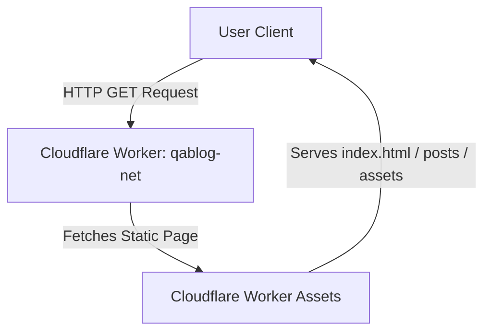

# QABlog.net - Software Quality Assurance Blueprint

QABlog.net is a premium, high-performance static engineering blog built using Astro and deployed to Cloudflare Workers via static asset hosting. It houses professional quality assurance, test automation, and performance engineering blueprints.

## Functional Features
* **Modern Static Blog Architecture (SSG):** All blog posts, category collections, and layouts are compiled at build time into pure static HTML, CSS, and JS, guaranteeing instantaneous loading speeds and zero runtime server overhead.
* **Astro Content Layer Integration:** Uses the modern Astro Content Collections API with the file-system glob loader to compile markdown posts dynamically.
* **Premium Responsive UX:** Restores and enhances the provided template design featuring:
  * A scroll-bound reading progress indicator.
  * A sliding social sharing drawer (Twitter, Facebook, WhatsApp) on individual post pages.
  * A responsive sidebar navigation drawer with automatic menu toggling on mobile viewports.
* **Category Quick-Pill Navigation:** Responsive tag filters allowing users to view articles filtered by `Architecture`, `Execution`, `Extensions`, `Observability`, and `Windows Operations`.
* **Automated RSS and Sitemap:** Automatically generates an RSS Feed (`/rss.xml`) and Sitemap (`/sitemap-index.xml`, `/sitemap-0.xml`) during build execution, ensuring search engines crawl new blueprints immediately.
* **SEO & Metadata Optimization:** High-fidelity SEO configuration featuring canonical URL resolution, dynamic JSON-LD structural schema generation, OpenGraph metadata, and Twitter Card attributes.

## User Guide

### 1. Running the Site Locally
To run the blog's development server locally on your machine:
```bash
# Install dependencies
npm install

# Start the Astro local development server
npm run dev
```
Open [http://localhost:4321](http://localhost:4321) in your browser to view the blog.

### 2. Writing a New Post
To publish a new blueprint, simply create a new Markdown file under the `src/content/blog/` directory:
```markdown
---
title: "Your Post Title Here"
description: "A summary of the post content."
pubDate: "2026-06-14"
author: "Author Name"
tags: ["Tag1", "Tag2"]
category: "Architecture"
coverImage: "/images/hero_visual.png"
---

Your markdown-formatted blog post body content goes here.
```
Supported categories include: `Architecture`, `Execution`, `Extensions`, `Observability`, and `Windows Operations`.

### 3. Compiling the Production Build
To compile the site into static assets:
```bash
npm run build
```
This command compiles all pages, compiles the CSS styles, and generates the sitemap and RSS feed files into the `dist/client/` directory.

### 4. Deploying to Cloudflare
Deploy the compiled directory directly to Cloudflare Workers static asset hosting:
```bash
npx wrangler deploy
```

## Architecture Information

The QABlog.net deployment leverages Cloudflare's next-generation single-worker static asset hosting architecture:



* **Single-Worker Assets Hosting:** The entire static build from `./dist/client` is bundled and deployed inside a single Cloudflare Worker using the `"assets": { "directory": "./dist/client" }` wrangler configuration. 
* **Data Flow:**
  1. During build time, Astro loads Markdown files from `src/content/blog/`, parses frontmatter schemas, formats HTML pages using layouts (`BaseLayout`, `PostLayout`), and injects metadata.
  2. The `@astrojs/sitemap` and `@astrojs/rss` integrations parse the compiled URLs and publish sitemaps and feeds.
  3. Wrangler uploads the build artifacts to Cloudflare's global edge network.
  4. Client requests are routed instantly by the Worker to serve pre-rendered HTML files, ensuring a 100/100 Lighthouse performance score.

## Tech Stack
* **Framework:** [Astro v6](https://astro.build/) (Static Site Generation mode)
* **Styling:** Tailwind CSS (v3) & Template Vanilla CSS styles
* **Deployment & Hosting:** [Cloudflare Workers Static Assets](https://workers.cloudflare.com/) (Wrangler CLI)
* **Integrations:**
  * `@astrojs/tailwind` - Tailwind integration
  * `@astrojs/sitemap` - Automated XML sitemaps
  * `@astrojs/rss` - RSS feed generation
  * `@astrojs/cloudflare` - Cloudflare Workers deployment adapter

## Pending Features and Roadmap
* [ ] **Search Engine Optimization Enhancements:** Integrate full-text local client-side search (e.g. Pagefind or Lunr.js) to allow users to search blueprints instantly without any backend.
* [ ] **Automated Performance Regression Gates:** Setup Lighthouse CI actions in GitHub workflows to block pull requests that degrade performance below the 100/100 goal.
* [ ] **Dark Mode Sync:** Connect the styling system to system prefers-color-scheme setting to enable native dark-mode swapping.
